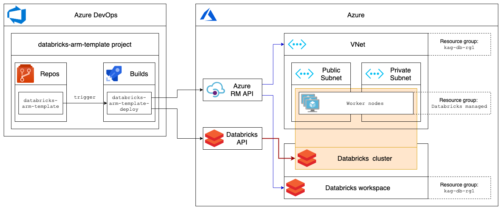

| Linux build status | Windows build status | License |
| ------------- | ------------- | ------------- |
| [](https://dev.azure.com/kagarlickij/databricks-arm-template/_build/latest?definitionId=65&branchName=master) | [](https://dev.azure.com/kagarlickij/databricks-arm-template/_build/latest?definitionId=66&branchName=master) | [](LICENSE.md) |

# Task
Provision Azure Databricks workspace and cluster ([only interactive cluster can be created in advance](https://docs.databricks.com/clusters/index.html))  
Cluster nodes must be located in VNet  

# Solution


# Challenges
## Databricks cluster can't be created with ARM template
Instead of it [Databricks API](https://docs.microsoft.com/en-us/azure/databricks/dev-tools/api/latest/clusters#--create) must be used  
To use API you have to have the token, previously it was possible only via manual action in Databricks UI  
Now Azure AD can be used to create Databricks token  
For security purposes I generate token in pipeline with 20 min TTL (it's required to initiate cluster creation and check result)  

## Databricks API is not available right after Workspace is created
It becomes available few seconds after Workspace deployment is complete, so pipeline has `sleep 60` task  

## Databricks API asynchronous way
`2.0/clusters/create` API is asynchronous, that means that you have to check if cluster was successfully created with `2.0/clusters/get` in a while  
I tested pipeline with rather small clusters so pipeline has `sleep 600` task, if you create big clusters deploy time might be larger, so increase that value  

# Azure CLI vs PowerShell
Azure CLI is selected to achieve cross-platform capabilities and keep syntax common in both [linux-pipeline.yml](linux-pipeline.yml) and [windows-pipeline.yml](windows-pipeline.yml)  
[PowerShell Az module](https://docs.microsoft.com/en-us/powershell/azure/new-azureps-module-az?view=azps-3.7.0) is also available for all platforms but it requires Linux and macOS to have [PowerShell Core](https://github.com/PowerShell/PowerShell) installed  
Another disadvantage of PowerShell Az module is maturity and convenience, e.g. you have to use something like:
```powershell
Get-AzResourceGroup -Name "$(rgName)" -ErrorVariable notPresent -ErrorAction SilentlyContinue
if ($notPresent) {
    Write-Output "Resource group does not exist, creating.."
    New-AzResourceGroup -Name "$(rgName)" -Location "$(region)"
} else {
    Write-Output "[ERROR] Resource group already exists"
    [Environment]::Exit(1)
}
```
..instead of just `az group exists --name $(rgName)` in Azure CLI  
Another issue is that Azure DevOps agents have outdated version of PowerShell Az module (at the time it's 3.5 vs 3.7 on local machine),  
so you'll have to run `Install-Module -Name Az -AllowClobber -Force` everytime when pipeline runs  
The last drop is `-TemplateParameterObject` param of `Test-AzResourceGroupDeployment`, it looks to be broken and the workaround is to generate json file and use it as `-TemplateParameterFile` which is quite ugly  

# Required input (Azure DevOps variable groups)
## azure-connection
| Name | Value | Type | Comment |
|--|--|--|--|
| azureSubscription | `Pay-As-You-Go (b31bc8ae-8938-41f1-b0b2-f707d811d596)` | Regular | Subscription Name under which the build will be performed |

## azure-tags
| Name | Value | Type | Comment |
|--|--|--|--|
| environment | `sbx` | Regular | Azure Tag used to track environments |
| project | `databricks-arm-template` | Regular | Azure Tag used to track projects |

## azure-databricks
| Name | Value | Type | Comment |
|--|--|--|--|
| region | `centralus` | Regular | Location for all resources |
| rgName | `databricks-rg1` | Regular | Name of the Resource group to be used for Databricks and VNet |
| workspaceName | `databricks-workspace1` | Regular | The name of the Azure Databricks workspace to create |
| clusterName | `databricks-cluster1` | Regular | Cluster name requested by the user. This doesn't have to be unique |
| clusterVersion | `6.4.x-scala2.11` | Regular | The runtime version of the cluster. You can retrieve a list of available runtime versions by using the [Runtime Versions API call](https://docs.microsoft.com/en-us/azure/databricks/dev-tools/api/latest/clusters#clusterclusterservicelistsparkversions) |
| clusterDriverSize | `Standard_D3_v2` | Regular | The node type of the Spark driver |
| clusterWorkersSize | `Standard_D3_v2` | Regular |The node type of the Spark worker |
| clusterWorkersQuantity | `1` | Regular | Number of worker nodes that this cluster should have (autoscaling is disabled) |
